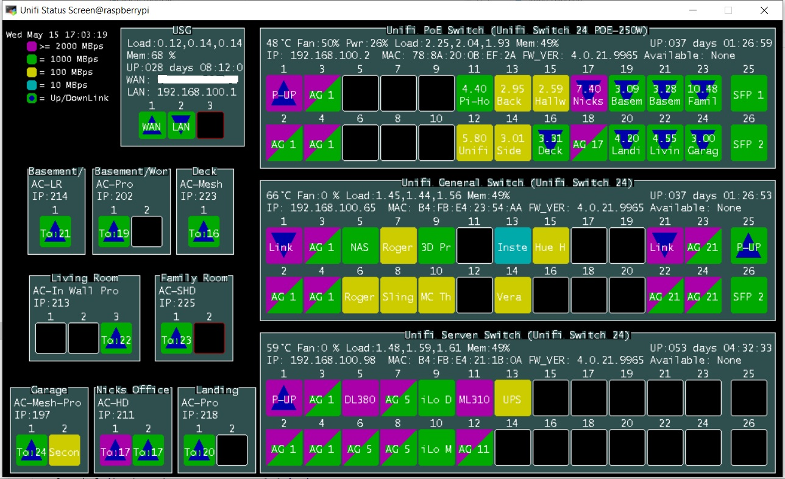
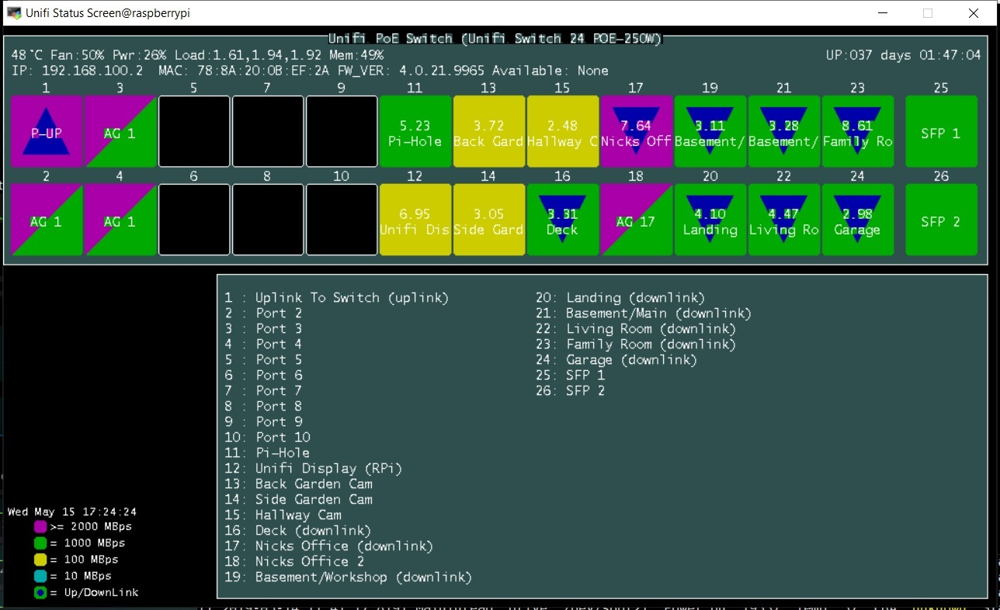

# Unifi-websocket-interface
A Websocket client for Unifi Controller and an example RPi based display program.

## unifi_client.py
The websocket client is `unifi_client.py`

You can run it from the command line as an example, but mostly you would import it as a module.

`unify_client.py` is designed for python 3.4 and above, tested under python 3.5, but includes support for python 2.
It uses asyncio-http so you need to install `aiohttp` for python 3.x. You also need `asyncio` support.
`unifi_client_3.py` is the python 3 websocket client class, so it needs to be in the same directory as `unifi_client.py`

The Python 2 websocket uses `requests` and `websocket-client`, so you need to have both installed if you are using python 2.

`unifi_client.py` can also optionally publish data to an mqtt topic, for which you need `paho-mqtt` installed.

here is the help text:

```bash
nick@proliant:~/Scripts/Unifi-websocket-interface$ ./unifi_client.py -h
usage: unifi_client.py [-h] [-po UNIFI_PORT] [-s] [-b BROKER] [-p PORT]
                       [-u USER] [-pw PASSWD] [-pt PUB_TOPIC] [-l LOG] [-D]
                       [-V]
                       IP username password

Unifi MQTT-WS Client and Data

positional arguments:
  IP                    IP Address of Unifi Controller. (default: None)
  username              Unifi username. (default=None)
  password              unifi password. (default=None)

optional arguments:
  -h, --help            show this help message and exit
  -po UNIFI_PORT, --unifi_port UNIFI_PORT
                        unifi port (default=8443)
  -s, --ssl_verify      Verify Certificates (Default: False)
  -b BROKER, --broker BROKER
                        mqtt broker to publish sensor data to. (default=None)
  -p PORT, --port PORT  mqtt broker port (default=1883)
  -u USER, --user USER  mqtt broker username. (default=None)
  -pw PASSWD, --passwd PASSWD
                        mqtt broker password. (default=None)
  -pt PUB_TOPIC, --pub_topic PUB_TOPIC
                        topic to publish unifi data to. (default=/unifi_data/)
  -l LOG, --log LOG     log file. (default=None)
  -D, --debug           debug mode
  -V, --version         show program's version number and exit
```

You have to supply an ip (or FQDN), username and password (your Unifi login credentials), and optionally the port number (default is 8443).

Example command lines:
- `./unifi_client.py 192.168.x.x username password`
- `./unifi_client.py 192.168.x.x username password -D` with debugging output so that you can see the data
- `./unifi_client.py 192.168.x.x username password -po 8444` different default unifi port
- `./unifi_client.py 192.168.x.x username password -b 192.168.x.y` publish data to your mqtt broker at 192.168.x.y (no mqtt user or password)

## unifi.py
`unifi.py` is an example __Python 3__ program using unifi_client.py to update a network status display on an RPi3 (800x600 size). It uses some obscure graphics libraries, so it's not easy to get working, but it's more of an example of how to get and use the data than anything else.
I did increase the size of the display to 1024x800 later.

To install the required graphics library for `unifi.py` proceed as follows:
1) Download the keyring file https://github.com/ev3dev/grx/files/2824733/keyring.tar.gz
2) `sudo cp ev3dev-archive-keyring.gpg /etc/apt/trusted.gpg.d/`
3) follow the instructions here https://github.com/ev3dev/grx/wiki/Developing-on-Raspberry-Pi ignoring the non-existent keyring link.

__NOTE__ You do not need console-runner, and I never got it to work anyway.

__NOTE__ Pay attention to the bitmap fonts comment, it is required.

Here is the help text for unifi.py:
```
pi@raspberrypi:~/unifi $ ./unifi.py  -h
usage: unifi.py [-h] [-p PORT] [-s] [-f FONT_SIZE] [-t] [-c CUSTOM] [-l LOG]
                [-D] [-li] [-S SIMULATE] [-V]
                IP username password

Unifi Status Screen

positional arguments:
  IP                    IP Address of Unifi Controller. (default: None)
  username              Unifi username. (default=None)
  password              unifi password. (default=None)

optional arguments:
  -h, --help            show this help message and exit
  -p PORT, --port PORT  unifi port (default=8443)
  -s, --ssl_verify      Verify Certificates (Default: False)
  -f FONT_SIZE, --font_size FONT_SIZE
                        font size - controlls device size (default=10)
  -t, --extra_text      Display Extra text in APs to fill screen (Default
                        false)
  -c CUSTOM, --custom CUSTOM
                        use custom layout (default=None)
  -l LOG, --log LOG     log file. (default=None)
  -D, --debug           debug mode
  -li, --list           list built in devices (for use in simulation)
  -S SIMULATE, --simulate SIMULATE
                        simulate device - pass device type as argument, eg
                        US48P750 (default=None)
  -V, --version         show program's version number and exit
```

`custom.ini` allows you to specify the position and size of each item on the display. An example `custom.ini` file is included.

This is what it looks like:

Detail Screen:


### .bashrc
Here is an example of `.bashrc modifications` - add to the end of the `.bashrc` file to run `unifi.py` automatically

```
if [ -n "$SSH_CLIENT" ] || [ -n "$SSH_TTY" ]; then
  SESSION_TYPE=remote/ssh
# many other tests omitted
else
  case $(ps -o comm= -p $PPID) in
    sshd|*/sshd) SESSION_TYPE=remote/ssh;;
  esac
fi

#export GRX_DRIVER="gw 800 gh 480 dp 300"
export GRX_DRIVER="gw 1024 gh 600 dp 300"

if [ "$SESSION_TYPE" != "remote/ssh" ]; then
  cd ~/unifi
  while :
  do
    ./unifi.py 192.168.100.119 <login> <password> -c custom.ini -l unifi.log
    sleep 5
  done
fi
```

This will automatically start the monitor on boot if the pi is set to auto login to console. the `export GRX_DRIVER=` entry specifies the size of the screen you are using in pixels. if you exit the monitor (say by clicking on the menu), it will automatically start back up again.
If you log in via SSH, the monitor is not started.

### models.json file
The `models.json` file contains values for every uniFi device, and overrides those built into uvifi.py. You can edit it manually (to tweak values i may have got wrong), or you can update it semi-automatically using a utility included here `get_models.py`
If you want to re-create the models.json file from scratch, just delete it, and it will be recreated from scratch when you run `unifi.py` (all your changes will be lost).

## get_models.py
This is a utility program to populate the `models.json` file with unifi devices information. the `models.json` file must exist first! See above.

### Dependancies
You need to install the following modules:
- requests
- hjson
- bs4

ie
`pip3 install requests`
`pip3 install hjson`
`pip3 install bs4`

### Usage

Here is the help text for get_models.py:
```
pi@raspberrypi:~/unifi $ ./get_models.py -h
usage: get_models.py [-h] [-f FILES] [-u URL] [-up UPDATE] [-o OUT]
                     [-p PATTERN] [-a] [-l LOG] [-d] [-D] [-V]

extract model info from Unifi

optional arguments:
  -h, --help            show this help message and exit
  -f FILES, --files FILES
                        unifi files base location (default: /usr/lib/unifi)
  -u URL, --url URL     unifi url base location eg https://192.168.1.1:8443
                        (default; None)
  -up UPDATE, --update UPDATE
                        models file to update eg models.json (default; None)
  -o OUT, --out OUT     output file name (default; models_tmp.json
  -p PATTERN, --pattern PATTERN
                        pattern to search for (default; U7HD
  -a, --all             get all matches (not just first) default: False
  -l LOG, --log LOG     log file. (default=None)
  -d, --dryrun          dry run (no file written)
  -D, --debug           debug mode
  -V, --version         show program's version number and exit
```
The default action is to try to retrieve model information from the controller files on your computer. I don't recommend this. the best way to use it, is to run it as follows:
`./get_models.py -u https://192.168.x.x:8443 -up models.json`
Where `192.168.x.x:8443` is the ip address and port of your UniFi controller (no login or password required).
This will retrieve the javascript from your controller, extract the model information from it, ask you some easy questions, and finally update the `models.json` file.
It takes a while to retrieve the javascript, as it's huge. If you want to run it multiple times without downloading the javascript all the time, add the `-D` option, it will be more verbose, but it will store the javascript locally in a temporary directory and doesn't delete it. The next time you run with the `-D` option, the local files are loaded, so it's fast. Run without the `-D` if you want to download again (new controller release or something).

When new devices are found in the download, you need to answer the questions, the defaults are usually correct - **BUT read them carefully - they may not be!** if you make a mistake, just hit `^C` and run again.

One crucial question is:
```
Do you want to add the full Unifi data to the database (recommended)?
```
This adds the full data from the controller download to the models.json database. When you do this, it overrides all the answers you just gave, and allows`unifi.py` to read the port layout correctly from the controller configuration (so the ports on the devices are drawn with the correct spacing). This is a good thing!
Finally save the updated file `Do you want to overwrite the models.json file?`, there is no default answer, you have to enter `y` to update the file.

When you have updaded the `models.json` file, start (or restart) `unifi.py`, and it will load the new database. Any new devices should not be displayed properly...

## controller.py
`controller.py` is a module that gives access to the unifi API, and can be used for simple REST access to unifi data. it's cobbled together from various sources on the web (thanks to the contributors), I just added to it, it's not my work as such.

When the client first connects, it pulls the confguration data for __all__ your devices, so the first data hit is large, after that only updates are received from the controller. The data is in the same format as it is received, ie a list of dictionaries (received as json text). The current state is stored in the client in `UnifiClient.unifi_data`, which is only updated when you call `UnifiClient.devices()`. There are methods for accessing this data, all of which call the devices() method internally, so use the methods, rather than accessing unifi_data directly. Only sync and events methods are exposed, other types of updates (speed test and so on) are displayed in debug mode, but otherwise ignored. It would be easy to add handling for these updates though if you need them for something. Feel free to fork your own version.

## Summary
All is tested on Unifi 5.11.31, with FW 4.0.42/48. I have various AP's (UAP-AC-XX) some Unifi Switches and a USG (3 port).

Currently running on an RPi3, Python 3.5.3, but also works in my development environment (Ubuntu 18.04.1, Python 3.6.7).

Hope you find it useful.
There is no warranty...
